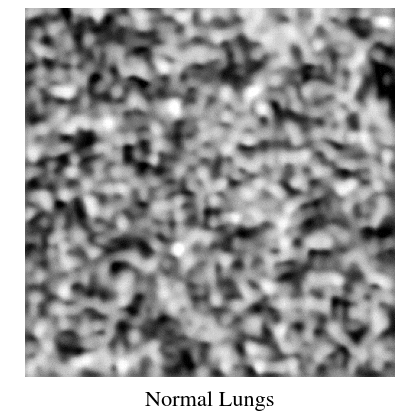

# Generating Medical Images with the Label-Conditioned Latent Diffusion Model (From Scratch)

 <div align="center">
    <a href="https://colab.research.google.com/github/reshalfahsi/medical-latent-diffusion-model/blob/master/Med_Image_Gen_Label_Cond_LDM.ipynb"></a>
    <br />
 </div>


<div align="center">
    
    </img>
    <br />
</div>


> What I cannot create, I do not understand
> 
> ― Richard Feynman


By 2021, we have witnessed the unprecedented feat of AI generating high-quality images and reshaping our digital world. We have reached this point thanks to a cutting-edge method: the latent diffusion model. This method is powered by prior research on VAE and diffusion models. Thus, out of curiosity, this project was done to realize the latent diffusion model from scratch. The VAE model employed in this project is VQ-VAE. DDPM is opted in for the diffusion model. Here, the PneumoniaMNIST dataset is used such that the latent diffusion model can generate chest X-ray images from random noise. Also, the generation is conditioned on labels: ``normal`` or ``pneumonia``. Additionally, to make how faithful the model to the label we can choose the value classifier free guidance scale for better improvement. Furthermore, to make the model more true to the label, we can adjust the value of the classifier-free guidance scale for better results.


## Experiment

You may use this [notebook](https://github.com/reshalfahsi/medical-latent-diffusion-model/blob/master/Med_Image_Gen_Label_Cond_LDM.ipynb) to synthesize an medical image (i.e., chest X-ray) conditioned on a particular label: ``normal``, ``pneumonia``, or ``None`` (the unconditional progressive generation).


## Result

### VQ-VAE

#### Quantitative Result

This table presents the VQ-VAE's reconstruction performance gauged with the VQ-VAE loss and LPIPS.

Test Metric | Score
----------- | -------------
Loss        | 0.0070
LPIPS       | 0.2709


#### Loss and LPIPS Curve

<p align="center">  <br /> Loss curves of VQ-VAE on PneumoniaMNIST train and validation sets. </p>

<p align="center">  <br /> LPIPS curves of VQ-VAE on PneumoniaMNIST train and validation sets. </p>


#### Qualitative Result

The image below exhibits the reconstruction quality of VQ-VAE.

<p align="center">  <br /> Progressive noising and de-noising are applied to the latent image.  </p>


### Latent Diffusion Model

#### Loss Curve

<p align="center">  <br /> The modified U-Net loss curves on the latent images of the PneumoniaMNIST train and validation sets. The curve of the EMA model of the U-Net on validation sets is also exhibited. </p>


#### Qualitative Reuslt


The first and second rows show the generated images and their latent images, respectively.

<table>
    <tr>
        <td> 
            
        </td>
        <td> 
            
        </td>
        <td> 
            
        </td>
    </tr>
    <tr>
        <td> 
            
        </td>
        <td> 
            
        </td>
        <td> 
            
        </td>
    </tr>
</table>


## Blog Post

```
Coming Soon!
```

## Citation

If you think this repository is helpful for your research, you may cite it:

```
@misc{medical-latent-diffusion-model,
   title = {Generating Medical Images with the Label-Conditioned Latent Diffusion Model (From Scratch),
   url = {https://github.com/reshalfahsi/medical-latent-diffusion-model},
   author = {Resha Dwika Hefni Al-Fahsi},
}
```


## Credit

- [Diffusion Models](https://github.com/dome272/Diffusion-Models-pytorch)
- [pytorch-stable-diffusion](https://github.com/hkproj/pytorch-stable-diffusion)
- [Stable Diffusion Implementation in PyTorch](https://github.com/explainingai-code/StableDiffusion-PyTorch)
- [High-Resolution Image Synthesis with Latent Diffusion Models](https://arxiv.org/pdf/2112.10752)
- [MedMNIST](https://medmnist.com/)
- [The Unreasonable Effectiveness of Deep Features as a Perceptual Metric](https://arxiv.org/pdf/1801.03924)
- [Perceptual Similarity Metric and Dataset](https://github.com/richzhang/PerceptualSimilarity)
- [Denoising Diffusion Probabilistic Models](https://arxiv.org/pdf/2006.11239)
- [Neural Discrete Representation Learning](https://arxiv.org/abs/1711.00937)
- [PyTorch Lightning](https://lightning.ai/docs/pytorch/latest/)
